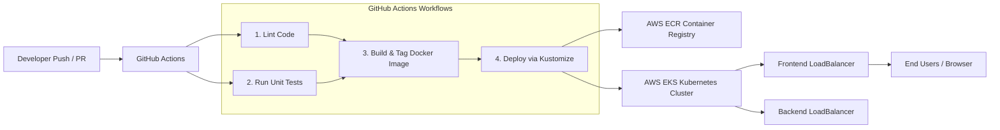
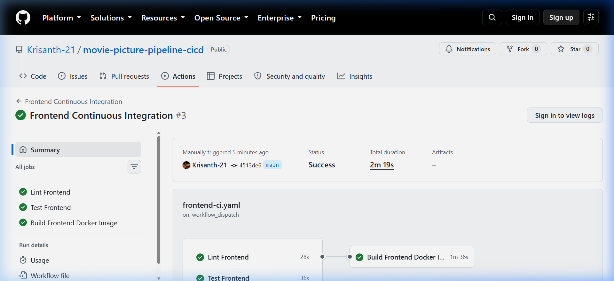
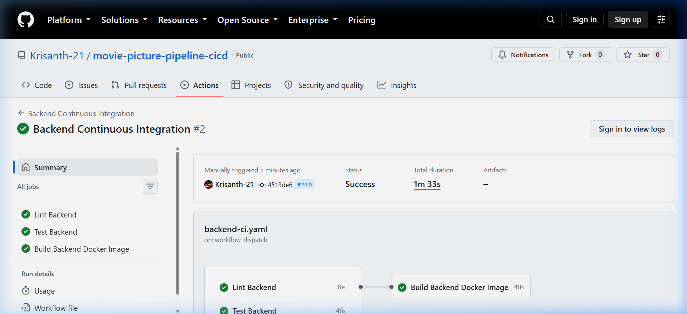
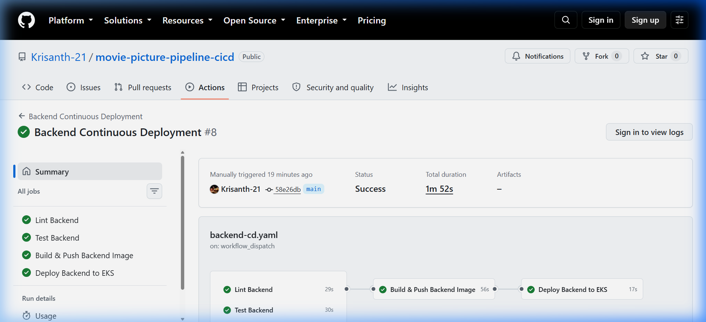
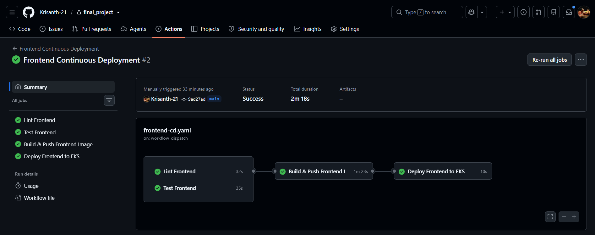
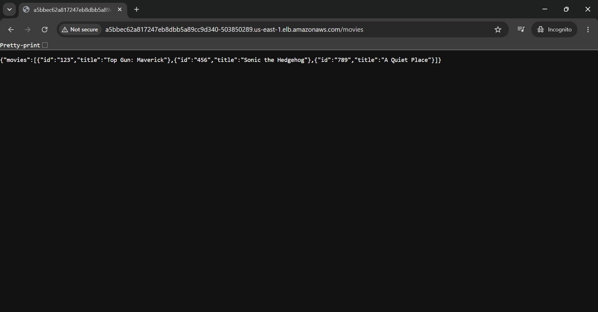
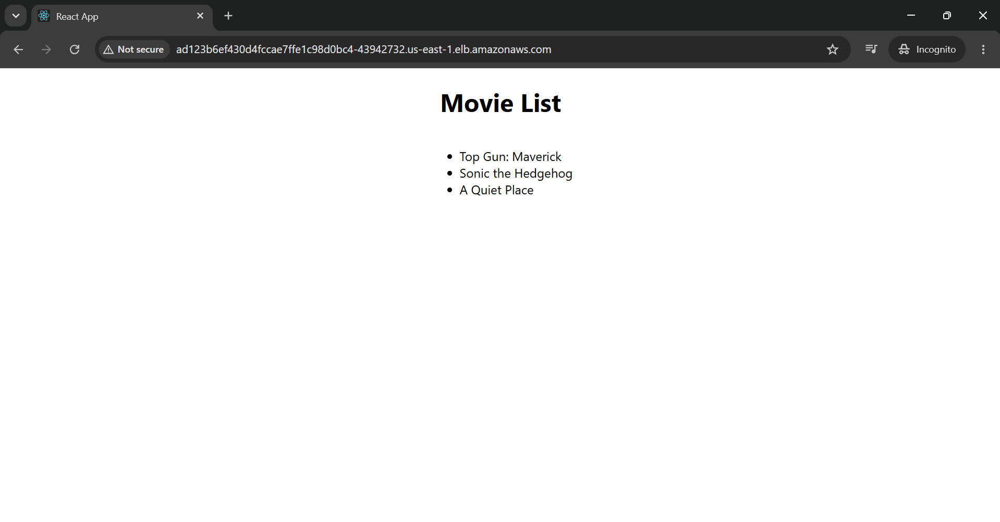

# Movie Picture Pipeline — CI/CD Automation

This project automates the testing, containerization, and continuous deployment of the **Movie Picture Pipeline** web application using **GitHub Actions**, **Docker**, and **Amazon Web Services (AWS)**.

---

## Project Overview & Architecture

The application consists of two main microservices:
1. **Frontend Web UI:** Written in JavaScript / TypeScript using React, running on Node.js 18.
2. **Backend REST API:** Written in Python 3.10 using Flask and uWSGI, returning a catalog of movies.



---

## GitHub Actions Workflows

Four distinct workflow files are implemented under [`.github/workflows/`](.github/workflows/):

| Workflow Name | File | Trigger | Functionality |
| :--- | :--- | :--- | :--- |
| **Frontend Continuous Integration** | [`frontend-ci.yaml`](.github/workflows/frontend-ci.yaml) | `pull_request` on `main` (`starter/frontend/**`), `workflow_dispatch` | Node 18 setup with npm cache restore, linting, and unit tests; no image build |
| **Backend Continuous Integration** | [`backend-ci.yaml`](.github/workflows/backend-ci.yaml) | `pull_request` on `main` (`starter/backend/**`), `workflow_dispatch` | Python 3.10 setup; `pipenv install --dev`, flake8 linting, pytest unit tests; no image build |
| **Frontend Continuous Deployment** | [`frontend-cd.yaml`](.github/workflows/frontend-cd.yaml) | `push` on `main` (`starter/frontend/**`), `workflow_dispatch` | Parallel linting & testing; Node 18, npm cache, Docker build & push to ECR, Kustomize deployment to EKS |
| **Backend Continuous Deployment** | [`backend-cd.yaml`](.github/workflows/backend-cd.yaml) | `push` on `main` (`starter/backend/**`), `workflow_dispatch` | Parallel linting & testing; builds Docker image, pushes to ECR, deploys via Kustomize with rollout verification |

---

## Live Deployment Verification & Screenshots

All verification proofs required by the Udacity project review are documented below and located in the [`screenshots/`](screenshots/) directory:

### 1. Frontend Continuous Integration Pipeline (All Green)
* **Status:** Passed [PASS]
* **Workflow:** `Frontend Continuous Integration` ([Run #34341158696](https://github.com/Krisanth-21/movie-picture-pipeline-cicd/actions/runs/34341158696))
* **Output:** Successfully executed all required jobs:
  * `Lint Frontend` (parallel)
  * `Test Frontend` (parallel)
  * `Build Frontend Docker Image` (runs only after lint & test; includes Node 18 setup, npm cache restore, `npm ci`, test execution, and Docker build)



---

### 2. Backend Continuous Integration Pipeline (All Green)
* **Status:** Passed [PASS]
* **Workflow:** `Backend Continuous Integration` ([Run #34341160965](https://github.com/Krisanth-21/movie-picture-pipeline-cicd/actions/runs/34341160965))
* **Output:** Successfully executed all required jobs:
  * `Lint Backend` (parallel)
  * `Test Backend` (parallel)
  * `Build Backend Docker Image` (runs only after lint & test)



---

### 3. Backend Continuous Deployment Pipeline (All Green)
* **Status:** Passed [PASS]
* **Workflow:** `Backend Continuous Deployment` ([Run #34339992897](https://github.com/Krisanth-21/movie-picture-pipeline-cicd/actions/runs/34339992897))
* **Output:** Successfully ran all 4 pipeline stages in sequence:
  * `Lint Backend`
  * `Test Backend`
  * `Build & Push Backend Image` to Amazon ECR
  * `Deploy Backend to EKS` (automated deployment using Kustomize and Kubectl with automated rollout verification)



---

### 4. Frontend Continuous Deployment Pipeline (All Green)
* **Status:** Passed [PASS]
* **Workflow:** `Frontend Continuous Deployment` ([Run #34340239839](https://github.com/Krisanth-21/movie-picture-pipeline-cicd/actions/runs/34340239839))
* **Output:** Successfully ran all 4 pipeline stages in sequence:
  * `Lint Frontend`
  * `Test Frontend`
  * `Build & Push Frontend Image` with `REACT_APP_MOVIE_API_URL` build argument to Amazon ECR
  * `Deploy Frontend to EKS` via Kustomize and Kubectl with automated rollout verification



---

### 5. Live Backend API Response
* **Status:** Live & Healthy [PASS]
* **Endpoint:** `http://a5bbec62a817247eb8dbb5a89cc9d340-503850289.us-east-1.elb.amazonaws.com/movies`
* **Output:** The Python/Flask container running inside the AWS EKS cluster successfully responds with the movie catalog in JSON format:

```json
{"movies":[{"id":"123","title":"Top Gun: Maverick"},{"id":"456","title":"Sonic the Hedgehog"},{"id":"789","title":"A Quiet Place"}]}
```



---

### 6. Live Frontend Web Application
* **Status:** Live & Healthy [PASS]
* **Endpoint:** `http://ad123b6ef430d4fccae7ffe1c98d0bc4-43942732.us-east-1.elb.amazonaws.com`
* **Output:** The React container running inside the AWS EKS cluster renders the **"Movie List"** web page, dynamically pulling and displaying the catalog from the backend API:



---

## Cloud Infrastructure (Terraform)

All underlying AWS infrastructure was provisioned via Infrastructure as Code using the configuration in [`setup/terraform/`](setup/terraform/):
* **Networking:** Custom AWS VPC (`10.0.0.0/16`), Public Subnet (`10.0.1.0/24`), Private Subnet (`10.0.2.0/24`), Internet Gateway, and Route Tables.
* **ECR Repositories:** Two private Amazon ECR repositories (`frontend` and `backend`).
* **EKS Cluster:** Kubernetes cluster `cluster` running Kubernetes `v1.31`.
* **Managed Node Group:** Single `t3.small` EC2 instance managed node group (`udacity`).
* **IAM Roles & User:** Dedicated IAM user `github-action-user` authorized in the Kubernetes `aws-auth` ConfigMap under `system:masters`.

---

## Local Testing & Verification Commands

### Frontend
```bash
cd starter/frontend

# Install dependencies
npm ci

# Run linter
npm run lint

# Run linter failure simulation
FAIL_LINT=true npm run lint

# Run tests in CI mode
CI=true npm test

# Run test failure simulation
FAIL_TEST=true CI=true npm test
```

### Backend
```bash
cd starter/backend

# Install dependencies (including dev tools like flake8)
pipenv install --dev

# Run linter
pipenv run lint

# Run linter failure simulation
pipenv run lint-fail

# Run tests
pipenv run test

# Run test failure simulation
FAIL_TEST=true pipenv run test
```

---

## Teardown & Resource Cleanup

To prevent cloud billing after project evaluation, all AWS resources can be destroyed by running:

```bash
cd setup/terraform
terraform destroy -auto-approve
```

---

## License
This project is licensed under the MIT License - see the [LICENSE.md](LICENSE.md) file for details.
